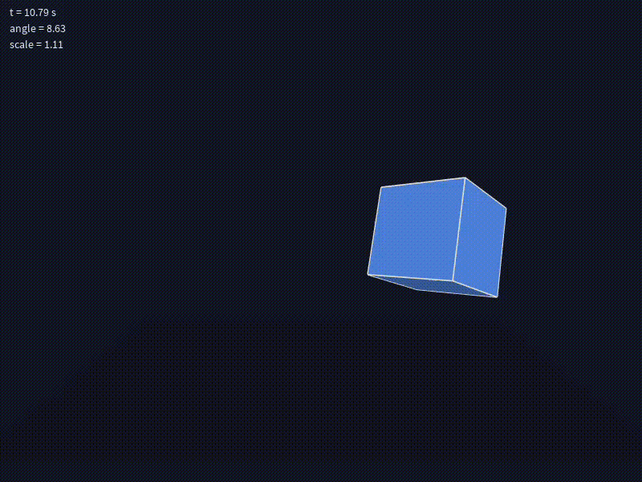

# 🎨 Processing Animation (2D/3D Transformations)

This project demonstrates a simple **Processing sketch** (Java mode) that applies transformations such as **translation**, **rotation**, and **scaling** over time. The animation uses built-in functions like `translate()`, `rotate()`, `scale()`, along with `pushMatrix()` and `popMatrix()` to isolate transformations.

---



## ✨ Features

- **Geometric Shape**  
  A 2D rectangle or 3D box can be animated.

- **Translation**  
  The shape moves along a wavy trajectory using `sin()` and elapsed time.  
  Implemented with `translate()`.

- **Rotation**  
  The shape rotates continuously around one or more axes.  
  Implemented with `rotate()` (`rotateX`, `rotateY`, `rotateZ` in 3D).

- **Scaling**  
  The shape grows and shrinks cyclically with `Math.sin()`.  
  Implemented with `scale()`.

- **Matrix Isolation**  
  `pushMatrix()` and `popMatrix()` ensure transformations only affect the intended shape.

---

## 📜 Core Code Example

```java
void draw() {
  background(18, 22, 35);

  float t = millis() / 1000.0;
  float angle = t * 0.8;
  float wave = sin(t * 1.2);
  float s = 1.0 + 0.3 * wave;

  pushMatrix();
  translate(width/2 + 180 * sin(t * 0.7), height/2, 120 * sin(t * 0.5));
  rotateY(angle);
  rotateX(angle * 0.7);
  scale(s);

  fill(90, 150, 255);
  stroke(220);
  box(120);
  popMatrix();
}
```

### 🚀 How to Run

- Download and install Processing IDE.

- Open a new sketch and paste the code.

### Click ▶ Run to view the animation.

### 📚 Learning Outcomes

- Understand how to use Processing for time-based animations.

- Learn how translate(), rotate(), scale() work together.

- Use pushMatrix() and popMatrix() to isolate transformations.

- Control animations with time functions (millis(), frameCount, sin()).
