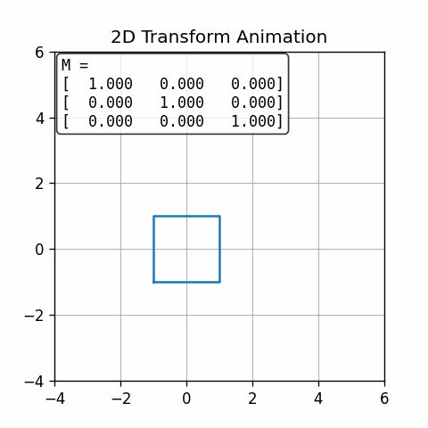

# 2D Transform Animation in Python

This project creates an **animated GIF** that demonstrates how a square can be transformed in 2D space through a sequence of **scaling, rotation, and translation** over 60 frames.

In each frame, the **current transformation matrix (M)** is displayed in the top-left corner, so you can see exactly how it changes step by step.

---

## How It Works

### 1. Shape Definition

- The base figure is a **square centered at the origin**.
- Homogeneous coordinates (3×3 matrices) are used to combine transformations.

### 2. Transformations Applied

Across the 60 frames, parameters vary gradually:

- **Rotation**: from 0° to 360°
- **Scaling**: from `(1.0, 1.0)` to `(0.5, 1.5)`
- **Translation**: from `(0, 0)` to `(3, 2)`

### 3. Frame Generation

- For each frame:
  - Compute the matrix **M**.
  - Apply **M** to all vertices of the square.
  - Plot the transformed shape.
  - Show the full 3×3 matrix on the plot.

### 4. Final Output

- All frames are collected and exported into a single animated GIF.
