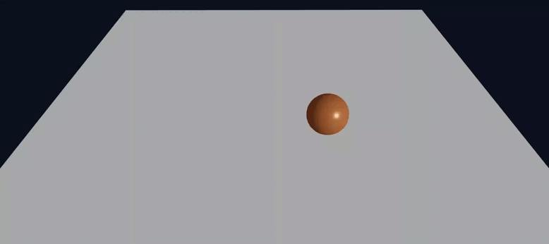

# Three.js Animation with React Three Fiber

The final result is a **3D animation** created using **Three.js** and **React Three Fiber (R3F)**.  
The animation features a sphere that:

- Moves in a **circular trajectory** around the scene.
- Rotates continuously on its own axes.
- Scales smoothly over time using a sine-based function.

The scene is interactive, allowing users to navigate with `OrbitControls`.



---

## 🔹 Scene Behaviors

All sphere behaviors are implemented inside the `useFrame` hook, which runs on every render frame.  
This hook allows real-time updates of object properties such as **position**, **rotation**, and **scale**.

### 🌀 Circular Movement

The sphere follows a circular trajectory using sine and cosine functions of the elapsed time:

```jsx
useFrame((state) => {
  const radius = 2;
  const t = state.clock.elapsedTime;

  meshRef.current.position.x = radius * Math.cos(t);
  meshRef.current.position.z = radius * Math.sin(t);
});
```

### 🔄 Rotation

The shpere rotates around its X and Y axes. The rotation speed is tied to the frame delta time:

```jsx
useFrame((_, delta) => {
  meshRef.current.rotation.x += delta * 0.8;
  meshRef.current.rotation.y += delta * 1.0;
});
```

### 🔍 Scaling

The sphere scales smoothly over time, creating a pulsating effect using the sine of elapsed time:

```jsx
useFrame((state) => {
  const t = state.clock.elapsedTime;
  const scale = 1 + 0.2 * Math.sin(t);
  meshRef.current.scale.set(scale, scale, scale);
});
```

### 🎮 Interactivity

The scene uses OrbitControls from @react-three/drei to make the camera interactive.
This allows the user to rotate, zoom, and pan freely around the scene.

```jsx
import { OrbitControls } from "@react-three/drei";

function App() {
  return (
    <Canvas>
      <ambientLight />
      <AnimatedCube />
      <OrbitControls enableDamping dampingFactor={0.08} />
    </Canvas>
  );
}
```

### 🚀 How to Run the Project

#### Open the project:

```shell
cd threejs
```

#### Install dependencies:

```shell
npm install
```

#### Run the development server:

```shell
npm run dev
```

Open http://localhost:5173/
to see the animation.

### 📚 Learning Outcomes

- Understand how to use React Three Fiber for 3D rendering.

- Animate objects using the useFrame hook.

- Apply translation, rotation, and scaling with math functions.

- Add OrbitControls for scene interactivity.
