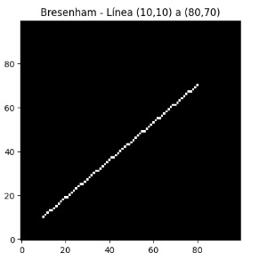
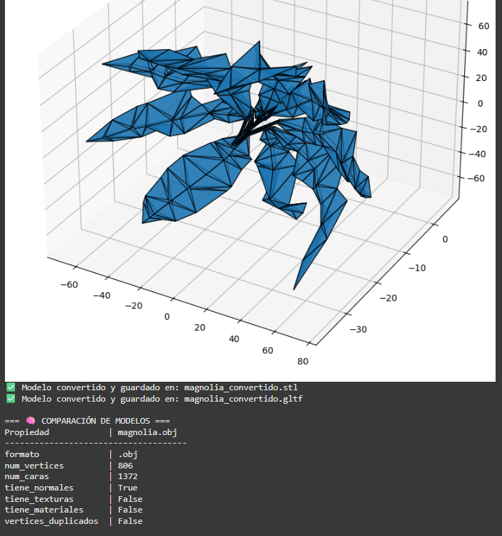
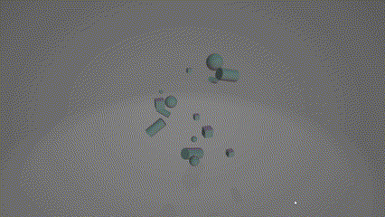

# Visual Computing & 3D Workshop

## Equipo:

- Michael Sebastian Caicedo Rosero
- Diego Leandro Rodriguez Diaz
- Sergio David Motta Romero
- Juan Diego Velasquez Pinzon
- Breyner Ismael Ciro Otero

## Workshop Summary

This repository documents the work completed for the Visual Computing & 3D Workshop. The primary goal of this workshop is to integrate key concepts from 3D graphics and computer vision into a series of practical, hands-on exercises. The topics explored range from fundamental image processing and color theory to real-time 3D rendering and gesture-based interaction.

Each exercise is implemented as a self-contained module, demonstrating specific techniques and principles. The projects utilize a variety of modern technologies, including Python with OpenCV for computer vision tasks and React Three Fiber for interactive 3D graphics on the web.

---

## Completed Exercises

This section details the exercises that have been completed so far.

---

## Exercise 2 — Digital Eyes (Filters and Edges with OpenCV)

### Objective
Understand the basic flow of visual perception in digital images: grayscale conversion, smoothing, sharpening, and edge detection using different methods.

### General Description
An image was loaded and the following steps were applied:  
1. Conversion to **grayscale**.  
2. Application of **smoothing (blur)** and **sharpen** filters.  
3. Edge detection using the **Sobel X**, **Sobel Y**, and **Laplacian** operators.  
4. (Bonus) Use of **interactive sliders** to adjust parameters in real time with **cv2.createTrackbar** and live visualization with the webcam.

### 📸 Evidence
- **Collage with results:**


- **Animated GIF:** showing real-time filter changes (sliders + webcam).


**Link to the code:**
 >  [Colab Code](./ejercicios/02_ojos_digitales_opencv/ejercicio_2_ojos_digitales.ipynb)


### Analysis of Differences Between Methods
- **Blur (smoothing):** reduces noise and fine details, ideal for preprocessing.  
- **Sharpen:** enhances edges and contrasts, but may amplify noise.  
- **Sobel:** detects directional edges; useful for vertical (X) and horizontal (Y) gradients.  
- **Laplacian:** computes the second derivative; detects edges regardless of direction, though it can be more sensitive to noise.

### Prompts Used
- "Que métodos proporciona OpenCV para aplicar blur, sharpen y Sobel? "
- "Como funciona y como puedo aplicar cv2.createTrackbar?"  

### Personal Comments
- **Learning:** I understood how filters highlight or smooth specific features of an image.  
- **Challenge:** Achieving a good combined visualization of edges without saturating the image.  
---
##  Exercise 3 — Segmenting the World (Binarization and Contours)

###  Objective
Apply image segmentation techniques using fixed and adaptive thresholding, and detect shapes through contours and image moments.

###  General Description
1. Apply **fixed thresholding** using `cv2.threshold()`.  
2. Use **adaptive thresholding** with `cv2.adaptiveThreshold()`.  
3. Detect **contours** with `cv2.findContours()`.  
4. Compute **centroids** using **image moments**.  
5. Calculate **area** and **perimeter** for each contour.  
6. (Bonus) Classify shapes based on the number of **vertices** using `cv2.approxPolyDP()`.

### 📸 Evidence
- **Animated GIF:**
  
  


**Link to the code:**
> [Python Code](./ejercicios/03_segmentacion_umbral_contornos/ejercicio_3_segmentando_el_mundo.py)

###  Personal Comments
- **Learning:** I gained a better understanding of how thresholding techniques help separate objects from the background, and how contours are useful for shape analysis.  
- **Challenge:** Finding the right thresholding parameters for different images and classifying complex shapes based on their geometry.


##  Exercise 4 — Image = Matrix (Channels, Slicing, Histograms)

###  Objective
Manipulate pixels and image regions directly, exploring how color channels are represented and how brightness and contrast adjustments influence the result.

###  General Description
1. Separation of **RGB** channels and conversion to **HSV**.  
2. Region editing through **slicing** (zone modification and copy/paste of sections).  
3. Generation of **intensity histograms**.  
4. Adjustment of **brightness and contrast** using `cv2.convertScaleAbs()`.  
5. (Bonus) Local interactive sliders to modify brightness and contrast in real time.

### 📸 Evidence
- **Before and after by regions:**
  - Slicing with color editing.
    
  

- **Histograms:**
  - Comparison between original and adjusted image.
  

- **Animated GIF:** showing brightness and contrast modifications with sliders.
  

**Link to the code:**
>  [Colab Code](.ejercicios/04_imagen_matriz_pixeles/ejercicio_4_matriz_pixeles.ipynb)

###  Personal Comments
- **Learning:** I gained a better understanding of how an image is a matrix and how to manipulate pixels directly.  
- **Challenge:** adjusting brightness and contrast without saturating values or losing details.  


###  Prompts Used
- "Como hago para separar RGB/HSV de una imagen jpg usando openCV?"
- "Comomanipulo el brillo y el contraste usando openCV?"  


---
### Exercise 5 — Rasterization from Scratch

- **Brief Explanation:**  
  This notebook implements three classic rasterization algorithms **from scratch**, without using any high-level graphics libraries (only **NumPy** and **Matplotlib**).

- **Implemented Algorithms:**

  - **Bresenham’s Line Algorithm:** Efficiently draws lines using only integer operations.
    - **Core Idea:** Move step by step along the X-axis, calculating an error term to decide when to increment Y — avoiding multiplications or divisions.
    - 
  - **Midpoint Circle Algorithm:** Rasterizes a circle by exploiting its **octagonal symmetry**, computing only one octant and reflecting points to complete the full shape.
    - **Core Idea:** Start from (0, r) and increment x. A decision parameter `p` determines whether the next point lies inside or outside the ideal circle. The results are reflected across 8 octants.
    - 
  - **Scanline Triangle Fill:** Fills a triangle **row by row**, intersecting its edges with each horizontal scanline.
    - **Core Idea:** Sort vertices by Y, compute intersections for each row, and fill pixels between left and right intersections.
    - 

- **Link to Code:**

  - [View Rasterization Code](./ejercicios/05_rasterizacion_clasica/)

- **Personal Comments:**
  - **Learning:** This exercise provided insight into how modern rendering systems approximate continuous geometry through discrete pixels — the foundation of real-time 3D graphics.
  - **Challenges:** Ensuring pixel accuracy without floating-point errors was key, especially for steep lines and edge cases in the scanline algorithm.

---

### Exercise 6 Geometric Analysis (Centroid, Area, Perimeter)
This project uses Python and OpenCV to detect and analyze geometric shapes in an image, calculating metrics like area, perimeter, and centroid.


**Link to the code:**
 >  [Python Code](./ejercicios/06_analisis_figuras_geometricas/ejercicio_6_analisis_geometrico.py)

- **Personal Comments**
Learning: The key was using cv2.RETR_TREE to find nested shapes and combining vertex counts with circularity for better classification.

- **Challenges:**
 The main challenge was handling noisy images, which required better contour filtering and clean label placement.

- **Future Improvements:**
  Dynamically adjust parameters based on image properties and explore ML for complex shape classification.

**Dependencies and How to Run**
  
Install:
```python
pip install opencv-python numpy Pillow
```
**Prepare:** Place your image as image.jpg in the root folder.

Run:
```python
python analizar_formas.py
```

---

### Exercise 7 — Importing the World (OBJ/STL/GLTF)

### Objective
Explore techniques for manipulating, analyzing, and visualizing 3D models in different formats (`.OBJ`, `.STL`, `.GLTF`), using Python with Trimesh and JavaScript with React Three Fiber. Understand the internal structure of 3D models, compare their geometric properties, and visualize differences between file formats.

### General Description

This exercise is divided into two main implementations:

#### Python Implementation:
1. **Model Loading:** Load 3D models using `trimesh.load()` for various formats.
2. **Property Analysis:** Extract geometric information including vertices, faces, normals, textures, volume, and center of mass.
3. **Format Conversion:** Transform models between different formats (.OBJ, .STL, .GLTF) using `mesh.export()`.
4. **Visualization:** Render models using Matplotlib with 3D projections for comparative analysis.

#### React Three Fiber Implementation:
1. **Interactive Viewer:** Create a web-based 3D model viewer with format switching capabilities.
2. **Model Loading:** Implement format-specific loaders for each 3D file type.
3. **Statistics Display:** Show real-time information about loaded models (vertex count, format, file size).
4. **Camera Controls:** Enable orbit controls for interactive 3D navigation.

### 📸 Evidence

**Python - Model Analysis and Visualization:**


**React Three Fiber - Interactive 3D Viewer:**


**Link to the code:**
- [Python Implementation](./ejercicios/07_conversion_formatos_3d/python/)
- [React Three Fiber Viewer](./ejercicios/07_conversion_formatos_3d/threejs/)

### Analysis of Format Differences

- **OBJ Format:** Best for preserving texture coordinates (UV mapping) and material definitions. Widely supported but lacks animation support.
- **STL Format:** Simple and robust, ideal for 3D printing applications. Only stores geometry (vertices and faces), no color or texture information.
- **GLTF Format:** Modern web-optimized format supporting materials, textures, animations, and PBR workflows. Ideal for real-time rendering in web applications.

---

### Exercise 8 — Parametric Scenes (Objects from Data)

### Objective
Explore techniques for programmatic generation of 3D objects from structured data, using Python with vedo/trimesh/open3d and JavaScript with React Three Fiber. Understand how to create geometry in real-time through code, using loops, conditionals, and data-driven parametrization.

### General Description

This exercise demonstrates how to transform abstract data into 3D geometric representations through parametric generation:

#### Python Implementation:
1. **Data Generation:** Create random 3D point distributions or load from CSV files.
2. **Parametric Objects:** Generate primitives (spheres, cubes, cylinders) with data-driven properties.
3. **Conditional Styling:** Apply different geometries and properties based on data conditions.
4. **Visualization:** Render scenes using vedo with interactive controls.
5. **Export:** Save generated scenes to standard 3D formats (.OBJ, .STL, .GLTF).

#### React Three Fiber Implementation:
1. **Data Visualization:** Transform data arrays into 3D object collections.
2. **Layout Systems:** Implement circular, grid, and spiral arrangements.
3. **Interactive Controls:** Use Leva for real-time parameter adjustment.
4. **Dynamic Regeneration:** Update scenes based on user input and data changes.

### 📸 Evidence

**Python - Parametric Scene Generation:**


**React Three Fiber - Interactive Data Visualizer:**


**Link to the code:**
- [Python Implementation](./ejercicios/08_escenas_parametricas/python/)
- [React Three Fiber Visualizer](./ejercicios/08_escenas_parametricas/threejs/)

### Parametric Concepts Explored

- **Data-Driven Geometry:** Object properties (size, position, color) controlled by input data.
- **Procedural Generation:** Algorithmic creation of complex scenes from simple rules.
- **Layout Algorithms:** Spatial arrangement patterns (circular, grid, spiral, random).
- **Conditional Rendering:** Different geometries based on data thresholds or categories.
- **Real-Time Updates:** Dynamic scene regeneration based on parameter changes.
---

### Exercise 9 — Visual Filter (Custom Convolutions)

- **Brief Explanation:**  
  This exercise implements a **manual 2D convolution** and compares the results against OpenCV’s `cv2.filter2D`. Three different kernels were designed to explore common image filtering operations.

- **Implemented Kernels:**

  - **Sharpen:** Enhances fine details and edges.
  - **Blur:** Reduces noise by averaging neighboring pixels.
  - **Edge Detection:** Highlights contours and intensity transitions.
    - 

- **Code Description:**  
  The program downloads the classic _Lena_ image, converts it to grayscale, and applies a **custom 2D convolution** by sliding a kernel (weight matrix) across each pixel. The manually computed output is then compared with OpenCV’s built-in convolution results, displaying both side by side.

- **Link to Code:**

  - [View Convolution Code](./ejercicios/09_convoluciones_personalizadas/)

- **Personal Comments:**
  - **Learning:** Implementing convolution from scratch clarified the foundation of many computer vision and deep learning techniques.
  - **Challenges:** Managing image borders and normalizing pixel intensity values were the main technical difficulties.

---

### Exercise 10 — Exploring Color & Interactive Materials

- **Brief Explanation:** This exercise explored digital color representation in two parts. The first part used Python and OpenCV to analyze color models (RGB, HSV, LAB), visualize their channels, and simulate conditions like color blindness. The second, optional part, applied these concepts to a 3D environment using React Three Fiber, where an object's PBR material properties (color, roughness, metalness) were controlled in real-time through an interactive UI.
- **Key Results (GIFs):**

|               Python Color Analysis                |                Interactive 3D Materials                |
| :------------------------------------------------: | :----------------------------------------------------: |
|  |  |

- **Link to Code:**
  - [Python (Color Analysis)](./ejercicios/10_modelos_color_percepcion/python/)
  - [React Three Fiber (3D Scene)](./ejercicios/10_modelos_color_percepcion/threejs/)
- **Personal Comments:**
  - **Learning:** A key insight was understanding how abstract color spaces like HSV have practical applications in vision tasks. The 3D part provided a tangible visualization of PBR material properties, connecting theory with immediate visual feedback.
  - **Challenges:** The main challenge in the Python section was correctly applying the linear algebra for the daltonism simulation. For the 3D part, debugging dependency issues in the web environment was the primary hurdle.

---

### Exercise 12 — Webcam Gesture Control

- **Brief Explanation:** This project implemented a real-time gesture control system using Python and MediaPipe. The initial version focused on core gesture recognition: counting raised fingers and detecting a "pinch" by measuring the distance between the thumb and index finger. These gestures were mapped to control the color, size, and position of a circle. The project was then extended into a bonus minigame where the user must "pop" a randomly appearing target by moving their hand and using the pinch gesture.
- **Key Results (GIFs):**

|       V1: Gesture Controlled Object        |        V2: "Pop the Target" Minigame        |
| :----------------------------------------: | :-----------------------------------------: |
|  |  |

- **Link to Code:**
  - [View Gesture Control Code](./ejercicios/12_gestos_webcam_mediapipe/)
- **Personal Comments:**
  - **Learning:** This was an excellent introduction to the power of pre-trained models like MediaPipe. The primary learning was in translating raw landmark coordinates into robust, meaningful gestures. Implementing the minigame logic was a great exercise in managing application state and event detection.
  - **Challenges:** The main technical challenge was devising a reliable logic for counting fingers, especially the thumb. For the minigame, tuning the gesture thresholds for a responsive but not overly sensitive interaction was key.

---

_(More exercises will be added here as they are completed.)_

---

## Dependencies and How to Run

### Python Environment

- **Dependencies:** Python 3.8+, OpenCV, MediaPipe, NumPy.
- **Installation:**
  ```bash
  pip install opencv-python mediapipe numpy
  ```
- **Execution:** Navigate to an exercise directory and run the script.
  ```bash
  # Example for the minigame
  cd ejercicios/12_gestos_webcam_mediapipe/
  python game.py
  ```

### Three.js (React Three Fiber) Environment

- **Dependencies:** React, Three.js, and related libraries as specified in the `package.json` file within the exercise folder.
- **Execution:** The 3D scenes are hosted on CodeSandbox for live interaction. Local setup involves running `npm install` and `npm start`.

## Repository Structure

```
2025-10-05_taller_cv_3d/
├── ejercicios/
│   ├── 01_jerarquias_transformaciones/
│   ├── 02_ojos_digitales_opencv/
│   │   ├── ejercicio_2_ojos_digitales.ipynb
│   │   └── webcam_filters_sliders.py
│   ├── 03_segmentacion_umbral_contornos/
│   ├── 04_imagen_matriz_pixeles/
│   │   ├── ejercicio_4_matriz_pixeles.ipynb
│   │   └── imagen_matriz_pixeles_sliders.py
│   ├── 05_rasterizacion_clasica/
│       └── 05_rasterizacion_clasica.ipynb
│   ├── 06_analisis_figuras_geometricas/
│   ├── 07_conversion_formatos_3d/
│   ├── 08_escenas_parametricas/
│   ├── 09_convoluciones_personalizadas/
│       └── 09_filtro_visual.ipynb
│   ├── 10_modelos_color_percepcion/
│   │   ├── python/
│   │   └── threejs/
│   ├── 11_proyecciones_camara/
│   └── 12_gestos_webcam_mediapipe/
│       ├── gesture_controller.py
│       └── gesture_minigame.py
├── assets/
│   └── 10/
│       └── comparisson.png
│   └── 2/
│       └── Auto_P1Senna.jpg
│   └── 4/
│       └── Guacamaya.jpg
│   └── 5/
│       ├── bresenham.jpg
│       ├── punto_medio.jpg
│       └── scanline.jpg
│   └── 9/
│       └── lena_filtros.jpg
├── gifs/
│   ├── 2/
│   │   └── blur_shapen_sliders.gif
│   ├── 4/
│   │   └── bright_contrast_slider.gif
│   ├── 10/
│   │   ├── python.gif
│   │   └── threejs.gif
│   └── 12/
│       ├── gestures.gif
│       └── mini-game.gif
├── README.md
└── docs/
```

## Credits/References

- The gesture recognition capabilities in Exercise 12 are powered by the **MediaPipe Hands** library by Google.
- The interactive 3D scenes in Exercise 10 were built using the **React Three Fiber** and **leva** libraries.
