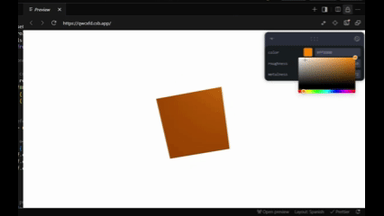

# Visual Computing & 3D Workshop

## Workshop Summary

This repository documents the work completed for the Visual Computing & 3D Workshop. The primary goal of this workshop is to integrate key concepts from 3D graphics and computer vision into a series of practical, hands-on exercises. The topics explored range from fundamental image processing and color theory to real-time 3D rendering and gesture-based interaction.

Each exercise is implemented as a self-contained module, demonstrating specific techniques and principles. The projects utilize a variety of modern technologies, including Python with OpenCV for computer vision tasks and React Three Fiber for interactive 3D graphics on the web.

---

## Completed Exercises

This section details the exercises that have been completed so far.

---

### Exercise 10 — Exploring Color & Interactive Materials

- **Brief Explanation:** This exercise explored digital color representation in two parts. The first part used Python and OpenCV to analyze color models (RGB, HSV, LAB), visualize their channels, and simulate conditions like color blindness. The second, optional part, applied these concepts to a 3D environment using React Three Fiber, where an object's PBR material properties (color, roughness, metalness) were controlled in real-time through an interactive UI.
- **Key Results (GIFs):**

|               Python Color Analysis                |                Interactive 3D Materials                |
| :------------------------------------------------: | :----------------------------------------------------: |
|  |  |

- **Link to Code:**
  - [Python (Color Analysis)](./ejercicios/10_modelos_color_percepcion/python/)
  - [React Three Fiber (3D Scene)](./ejercicios/10_modelos_color_percepcion/threejs/)
- **Personal Comments:**
  - **Learning:** A key insight was understanding how abstract color spaces like HSV have practical applications in vision tasks. The 3D part provided a tangible visualization of PBR material properties, connecting theory with immediate visual feedback.
  - **Challenges:** The main challenge in the Python section was correctly applying the linear algebra for the daltonism simulation. For the 3D part, debugging dependency issues in the web environment was the primary hurdle.

---

### Exercise 12 — Webcam Gesture Control

- **Brief Explanation:** This project implemented a real-time gesture control system using Python and MediaPipe. The initial version focused on core gesture recognition: counting raised fingers and detecting a "pinch" by measuring the distance between the thumb and index finger. These gestures were mapped to control the color, size, and position of a circle. The project was then extended into a bonus minigame where the user must "pop" a randomly appearing target by moving their hand and using the pinch gesture.
- **Key Results (GIFs):**

|       V1: Gesture Controlled Object        |        V2: "Pop the Target" Minigame        |
| :----------------------------------------: | :-----------------------------------------: |
|  |  |

- **Link to Code:**
  - [View Gesture Control Code](./ejercicios/12_gestos_webcam_mediapipe/)
- **Personal Comments:**
  - **Learning:** This was an excellent introduction to the power of pre-trained models like MediaPipe. The primary learning was in translating raw landmark coordinates into robust, meaningful gestures. Implementing the minigame logic was a great exercise in managing application state and event detection.
  - **Challenges:** The main technical challenge was devising a reliable logic for counting fingers, especially the thumb. For the minigame, tuning the gesture thresholds for a responsive but not overly sensitive interaction was key.

---

_(More exercises will be added here as they are completed.)_

---

## Dependencies and How to Run

### Python Environment

- **Dependencies:** Python 3.8+, OpenCV, MediaPipe, NumPy.
- **Installation:**
  ```bash
  pip install opencv-python mediapipe numpy
  ```
- **Execution:** Navigate to an exercise directory and run the script.
  ```bash
  # Example for the minigame
  cd ejercicios/12_gestos_webcam_mediapipe/
  python game.py
  ```

### Three.js (React Three Fiber) Environment

- **Dependencies:** React, Three.js, and related libraries as specified in the `package.json` file within the exercise folder.
- **Execution:** The 3D scenes are hosted on CodeSandbox for live interaction. Local setup involves running `npm install` and `npm start`.
