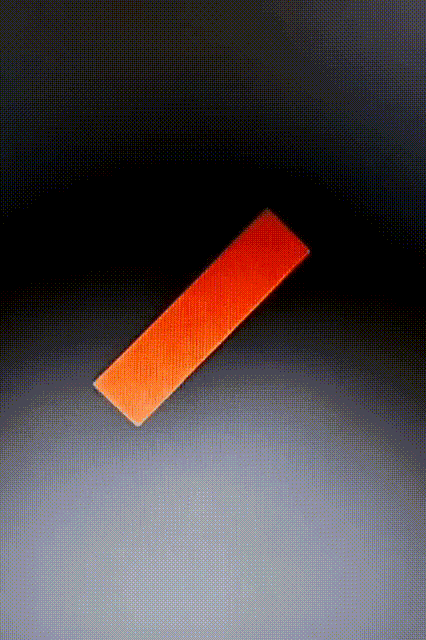
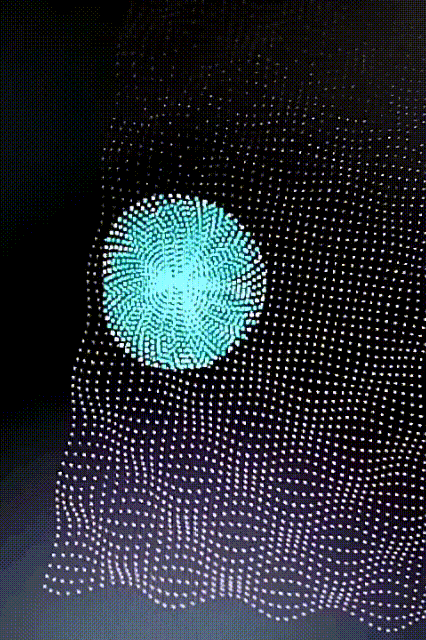
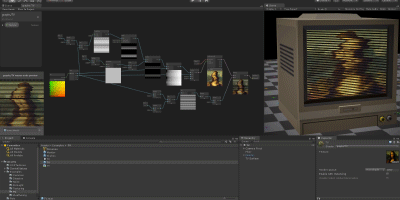
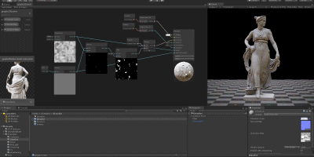
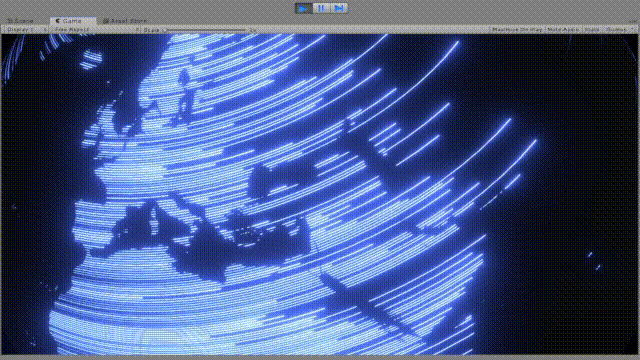
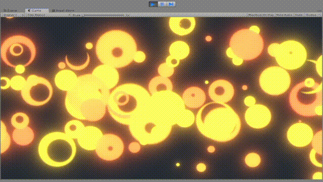
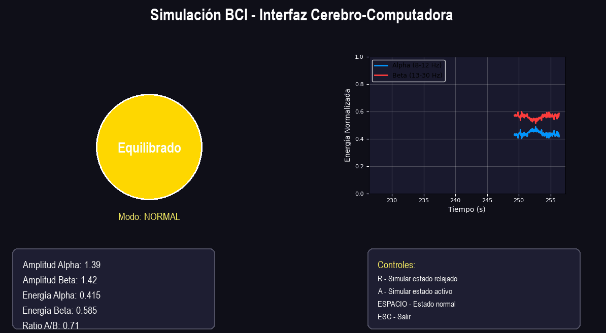
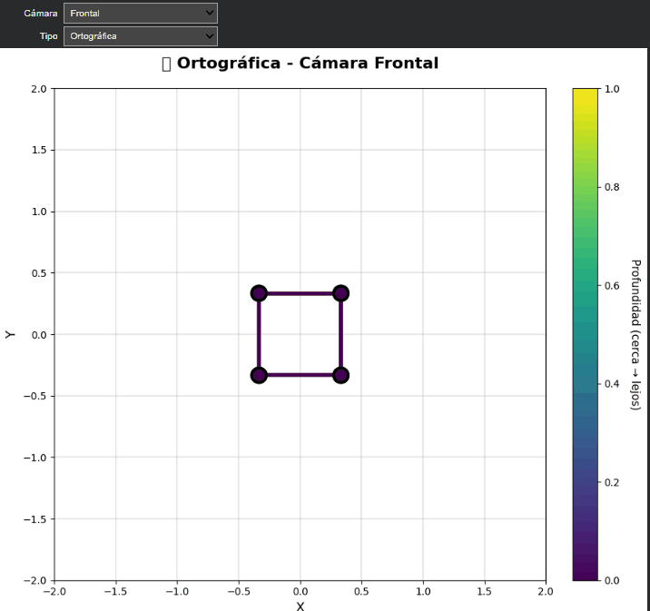

# Integrated workshop - visual computing

## Equipo:

- Michael Sebastian Caicedo Rosero
- Diego Leandro Rodriguez Diaz
- Sergio David Motta Romero
- Juan Diego Velasquez Pinzon
- Breyner Ismael Ciro Otero

## Workshop Summary

This repository documents the work completed for the workshop, showing interactive visual experiences that integrate 3D modeling, PBR materials, custom shaders, dynamic textures, multimodal sensing (voice, gestures, EEG), and camera or environment control. Each section explores a component of the graphics and sensory pipeline, uniting visual perception, light physics, procedural geometry, and human-computer interaction.

## Exercises

This section details the exercises that have been completed so far.

--
### Ejercicio 1. Materiales, luz y color (PBR y modelos cromáticos)

- **Descripción de lo realizado:**  
  En este ejercicio implementamos un **cubo de ladrillo centrado** usando Three.js y materiales PBR. Se aplicaron **texturas albedo, normal y roughness** para simular el material de forma realista.  
  La escena se iluminó con un **sistema de luces múltiples**: key light, fill light, rim light y luz ambiental. La cámara se centró en el cubo con perspectiva, y se ajustó para mantener la proporción al cambiar el tamaño de la ventana.  
  También se incorporó **animación** para rotar el cubo, permitiendo observar las variaciones de luz y material desde diferentes ángulos.

  

  Este ejercicio permitió comprender cómo **las texturas PBR y la iluminación múltiple** afectan la percepción de los materiales en 3D. Además, practicar la rotación animada y la gestión de la cámara refuerza el control sobre la escena y la composición visual.
  
### Ejercicio 2 — Modelado procedural desde código

**Descripción general:**  
Este ejercicio explora la generación de geometría mediante algoritmos, utilizando estructuras de control como bucles y funciones matemáticas para crear patrones espaciales. Se implementaron dos formas principales: una espiral y una rejilla, ambas animadas de forma dinámica para mostrar modificaciones de vértices en tiempo real.

**Lo que se realizó:**  
- Creación de una **espiral procedural** mediante cálculos trigonométricos (coseno y seno) que define posiciones de puntos en el espacio.  
- Generación de una **rejilla** usando bucles anidados para distribuir vértices en una cuadrícula regular.  
- **Modificación dinámica de vértices**: las posiciones de los puntos cambian cada cuadro según funciones sinusoidales, creando efectos de onda.  
- Implementación de **rotaciones y transformaciones** para acentuar el dinamismo visual.  
- Inclusión de un texto explicativo en pantalla comparando el **modelado procedural** (por código) con el **modelado manual** (por manipulación directa).

**Comparativa:**  
- El modelado procedural permite crear formas complejas con menos recursos, ideales para animaciones o entornos generativos.  
- El modelado manual ofrece control artístico detallado, pero es menos eficiente para patrones repetitivos o matemáticamente definidos.
  

Este ejercicio demuestra cómo el modelado por código puede producir resultados visualmente ricos y controlados, mostrando el potencial del pensamiento algorítmico en la creación tridimensional.

---
### 3. Custom Shaders and Effects

- **Brief explanation:**  
    A set of shader experiments implemented with **Shader Graph** and hand-written **HLSL/ShaderLab**. The collection demonstrates color driven by world position, time, and interaction; stylized toon shading and gradients; wireframe overlays and UV distortion; and procedural / dynamic blending of texture maps.
    
- **Core technologies:**  
    Unity (Built-in / URP), Shader Graph, HLSL/ShaderLab snippets, Shader keywords/properties, textures (albedo/normal/roughness/emissive), and optional Visual Effect Graph for combined effects.
  
**Key results (GIFs):**

 |  |  |
|----------------------------|-----------------------------------|
 
**Essential shader snippets and notes**

1. **World-position + time coloration (HLSL / simple unlit):**
```csharp
Shader "Custom/WorldTimeColor"
{
    Properties {
        _MainTex ("Base", 2D) = "white" {}
        _Speed ("Time Speed", Float) = 1.0
    }
    SubShader {
        Tags { "RenderType"="Opaque" }
        Pass {
            CGPROGRAM
            #pragma vertex vert
            #pragma fragment frag
            #include "UnityCG.cginc"

            sampler2D _MainTex;
            float _Speed;

            struct appv { float4 vertex : POSITION; float2 uv : TEXCOORD0; };
            struct v2f  { float4 pos : SV_POSITION; float2 uv : TEXCOORD0; float3 wpos : TEXCOORD1; };

            v2f vert(appv v) {
                v2f o;
                o.pos = UnityObjectToClipPos(v.vertex);
                o.uv  = v.uv;
                o.wpos = mul(unity_ObjectToWorld, v.vertex).xyz;
                return o;
            }

            fixed4 frag(v2f i) : SV_Target {
                float h = i.wpos.y * 0.2;                  // use height
                float t = _Time.y * _Speed * 0.1;          // time factor
                float blend = frac(h + t);                 // cycling blend
                fixed4 basec = tex2D(_MainTex, i.uv);
                fixed4 outc = lerp(basec, fixed4(1,0.5,0.2,1), blend);
                return outc;
            }
            ENDCG
        }
    }
}

```
- **Shader Graph equivalents & patterns**
    
    - Use `Position (World)` → split → `Y` as mask for height-based color blending.
        
    - Use `Time` node + `Sine`/`Noise` nodes for animated hue shifts.
        
    - Toon shading: compute `N·L`, pass through `Step` or sample a ramp texture (1D gradient) to quantize lighting.
        
    - Wireframe: generate barycentric coords on mesh (imported mesh with barycentric attributes) or use a second pass with edge detection in screen-space.
        
    - UV distortion: offset UV by procedural noise (`SimpleNoise` / `Voronoi`) multiplied by time.
        
- **Procedural / dynamic texture blending**
    
    - Mix multiple albedo maps using procedural masks (Perlin noise, height-based masks, or runtime-painted masks).
        
    - Use `MaterialPropertyBlock` or shader keywords to switch blend modes at runtime to avoid material duplication.

**Personal comments:**

- **Learning:** Shader Graph accelerates iteration; HLSL is required for fine control (barycentric wireframes, custom blending).
    
- **Challenges:** keeping parity between Built-in/URP/ HDRP (some nodes or macros differ), and ensuring correct normal space when distorting UVs.
    
- **Improvements:** add a small custom editor to toggle debug views (normals, masks, UVs) and provide material presets (Toon, Hologram, Wet Surface).


### 4. Dynamic Texturing and Particles

- **Brief explanation:**  
    Materials that react to time, user input, or sensors (simulated EEG / OSC), combined with particle systems synchronized to the same events. Techniques include animated maps (emissive ramps, animated normal maps, UV offsets), noise-driven normal/emissive, and particle bursts tied to material parameter changes.
    
- **Core technologies:**  
    Unity Particle System (Shuriken) and/or Visual Effect Graph (for GPU particle sets), C# scripting for runtime parameter updates, MaterialPropertyBlock, animated texture atlases, and optional compute shaders for high-performance updates.
    
- **Key results (GIFs):**

 | | |
|----------------------------|-----------------------------------|

**C# script: shader ↔ particle synchronization**


```csharp
// Assets/Scripts/ShaderParticleSync.cs
using UnityEngine;

[RequireComponent(typeof(Renderer))]
public class ShaderParticleSync : MonoBehaviour
{
    public ParticleSystem ps;
    Renderer rend;
    MaterialPropertyBlock mpb;
    public string shaderFloatName = "_Pulse";
    public float pulseSpeed = 1f;
    public float pulseThreshold = 0.6f;

    void Awake() {
        rend = GetComponent<Renderer>();
        mpb = new MaterialPropertyBlock();
    }

    void Update() {
        // compute a periodic value (could be driven by sensors or OSC)
        float value = 0.5f + 0.5f * Mathf.Sin(Time.time * pulseSpeed);

        // set material property (using MPB avoids creating new material instances)
        rend.GetPropertyBlock(mpb);
        mpb.SetFloat(shaderFloatName, value);
        rend.SetPropertyBlock(mpb);

        // trigger particle bursts when value passes threshold
        if (value > pulseThreshold && Random.value > 0.8f) {
            var emitParams = new ParticleSystem.EmitParams();
            emitParams.startColor = Color.Lerp(Color.cyan, Color.magenta, value);
            emitParams.startSize = 0.2f + value * 0.5f;
            ps.Emit(emitParams, 15);
        }
    }
}
```
- - **Notes:**
        
        - Use `MaterialPropertyBlock` to control material parameters per renderer without instancing.
            
        - For large numbers of objects, use GPU-driven VFX Graph where particles read the same param buffer or a texture (e.g., a "control" texture) that encodes event data.
            
- **Animated maps & normal/emissive update patterns**
    
    - **UV offset animation:** `mainTexOffset += speed * Time.deltaTime` (set from script or from shader `Time` node).
        
    - **Animated normal:** use a scrolling normal map or blend multiple normal maps via noise to create dynamic micro-surface.
        
    - **Emissive pulsing:** use shader `_EmissivePower` driven by a sin/noise function; clamp and optionally feed into bloom for glow.
        
- **Particle system patterns**
    
    - **Parameter-driven emission:** modify emission rate, burst intensity, particle color/size based on material parameter (as in script above).
        
    - **Collision-driven particles:** set particle collision modules to spawn particles on contact and use collision events to change material masks (e.g., paint-on-collision).
        
    - **GPU VFX Graph integration:** write material control values into a RenderTexture or Shader storage buffer, then sample it inside the VFX Graph to influence particle spawn or behavior.
        
- **Event coordination: shader + particles**
    
    - Use an event manager or OSC listener to broadcast a named event (e.g., `PulseEvent(strength)`); subscribers include: material controllers, particle emitters, camera post-processing controllers.
        
    - Keep strong separation: one system produces events, others react (helps testing & reuse).
        
- **Personal comments:**
    
    - **Learning:** synchronizing particles and shaders creates perceived cohesion — small, well-timed particle bursts dramatically increase impact.
        
    - **Challenges:** balancing performance (CPU vs GPU particles), and avoiding material instancing explosion when driving many objects individually.
        
    - **Improvements:** move heavy per-particle updates to GPU (VFX Graph or compute shaders) and use shared RTs / property blocks for control.
        

---

## Combined usage (3 + 4): workflow & integration

- **How they connect:**
    
    1. Procedural mesh or animated mesh provides geometric input (vertex height, UVs).
        
    2. Shader reads mesh attributes (world position, vertex color) and animates surface (emissive, UV distortion).
        
    3. C# controller broadcasts events or sets shader params (via `SetFloat` or `MaterialPropertyBlock`).
        
    4. Particle systems receive the same events and emit coordinated visual feedback (bursts, trails, decals).
        
- **Example pipeline:** sensor → event bus → `ShaderController` (material update) + `ParticleController` (emit) → post-process bloom/glow.
    


### 7. Webcam Gesture Control

- **Brief Explanation:** This project implemented a real-time gesture control system using Python and MediaPipe. The initial version focused on core gesture recognition: counting raised fingers and detecting a "pinch" by measuring the distance between the thumb and index finger. These gestures were mapped to control the color, size, and position of a circle. The project was then extended into a bonus minigame where the user must "pop" a randomly appearing target by moving their hand and using the pinch gesture.
- **Key Results (GIFs):**

|         Gesture Controlled Object          |          "Pop the Target" Minigame          |
| :----------------------------------------: | :-----------------------------------------: |
|  |  |

- **Link to Code:**
  - [View Gesture Control Code](./exercises/07_webcam_gestures_mediapipe_hands/)
- **Personal Comments:**
  - **Learning:** This was an excellent introduction to the power of pre-trained models like MediaPipe. The primary learning was in translating raw landmark coordinates into robust, meaningful gestures. Implementing the minigame logic was a great exercise in managing application state and event detection.
  - **Challenges:** The main technical challenge was devising a reliable logic for counting fingers, especially the thumb. For the minigame, tuning the gesture thresholds for a responsive but not overly sensitive interaction was key.

---

### 8. Voice Recognition and Command Control

- **Brief Explanation:**  
  This experiment integrates **Python voice recognition** with a **Processing visualization**. Spoken commands like “forward”, “left”, or “stop” are recognized through the microphone and transmitted via **OSC** to control on-screen elements in real time. The system also provides **spoken feedback** using text-to-speech, creating a complete voice-driven interaction loop.

- **Core Technologies:**  
  Python (`SpeechRecognition`, `pyttsx3`, `python-osc`, `pyaudio`) and Processing (`oscP5`).

- **Key Results (GIFs):**

  

- **📽️ Demo Video**

  - [🎥 Watch Demo Video](./assets/08/voice_control.mp4)

- **Link to Code:**

  - [View Code](./exercises/08_voice_recognition_and_command_control/)

- **Personal Comments:**
  - **Learning:** Exploring OSC communication between Python and Processing helped bridge audio input and graphical output effectively.
  - **Challenges:** Setting up PyAudio and achieving stable voice recognition accuracy required careful tuning of microphone sensitivity and noise thresholds.

---

### 9. Multimodal Interfaces: Voice + Hand Gestures (OSC → Processing)

- **Brief Explanation:**  
  Real-time control of a Processing sketch using **voice** and **hand gestures** via Python. Supports solo actions (voice _or_ gesture) and **combo** (voice+gesture within a short time window). The combo (“hand up” + “adelante”) triggers a higher-priority action.

- **Core Technologies:**  
  Python (`OpenCV`, `MediaPipe`, `SpeechRecognition`, `PyAudio`, `pyttsx3` optional, `python-osc`) + Processing (`oscP5`).

- **Key Results (GIF / Video):**  
    
  **Demo video:** [▶️ Watch](./assets/09/multimodal.mp4)

- **OSC Mapping (Python → Processing):**

  | Event Source      | OSC Address        | Processing Action                    | Color (RGB)        |
  | ----------------- | ------------------ | ------------------------------------ | ------------------ |
  | Gesture only      | `/saludo`          | `currentColor = color(255, 255, 0);` | Yellow (255,255,0) |
  | Voice: “adelante” | `/adelante`        | `currentColor = color(0, 100, 255);` | Blue (0,100,255)   |
  | Voice: “detener”  | `/detener`         | `currentColor = color(0);`           | Black (0,0,0)      |
  | **Combo (V+G)**   | `/adelante_rapido` | `currentColor = color(0, 255, 0);`   | Green (0,255,0)    |

- **Link to Code:**

  - [View Multimodal Code](./exercises/09_multimodal_interfaces_voice_gestures/)
  - Main script: `multimodal_control.py`

- **Personal Comments:**
  - **Learning:** Built a thread-safe event bus with timestamps, debounced gesture detection, and a **combo hold** to fuse modalities reliably.
  - **Challenges:** Tuning gesture threshold/frame window for responsiveness vs. stability; handling mic noise; aligning OSC routes with the Processing sketch.

---
## Exercise 10 — BCI Simulation (Synthetic EEG and Control)

### Objective
Simulate a Brain-Computer Interface (BCI) using synthetic EEG signals to classify mental states and trigger visual actions in real-time.

### General Description
1. Generation of **synthetic EEG signals** with Alpha (8-12 Hz) and Beta (13-30 Hz) bands.
2. Implementation of **Butterworth bandpass filters** using `scipy.signal`.
3. Calculation of **band energies** and classification based on thresholds.
4. **Interactive controls** to simulate relaxed, active, and normal mental states.
5. Real-time visualization with **PyGame** showing state changes through color, size, and metrics display.

### Evidence
- **Animated GIF:** showing mental state transitions and interactive controls.
  
  


**Link to the code:**
> [Python Code](./exercises/10_bci_simulation_synthetic_eeg_control/python/simulacion_BCI.py)

### Personal Comments
- **Learning:** I understood how EEG signals are processed and filtered to extract meaningful brain activity patterns.
- **Challenge:** Implementing the bandpass filters correctly and tuning the classification thresholds for realistic state transitions.
- **Insight:** The simulation effectively demonstrates how BCIs work by mapping brain signals to visual outputs.

### Prompts Used
- "Cómo implementar filtros pasa banda con scipy.signal para señales EEG?"
- "Cómo generar señales EEG sintéticas con componentes Alpha y Beta?"
- "Cómo crear una interfaz interactiva con PyGame para visualización en tiempo real?"

---
## Exercise 11 — Projective Spaces and Projection Matrices

### Objective
Explore projective geometry concepts through the implementation of orthographic and perspective projection matrices, visualizing 3D objects from different camera viewpoints.

### General Description
1. Implementation of **homogeneous coordinates** for 3D point representation.
2. Creation of **orthographic and perspective projection matrices** from scratch.
3. Development of **view matrices** (lookAt) for camera positioning.
4. Visualization of a 3D cube from **4 different cameras** (Frontal, Superior, Lateral, Isometric).
5. **Interactive selector** with `ipywidgets` to switch between cameras and projection types.
6. **Depth visualization** using color gradients (Z-buffer simulation).

### Evidence
- **Animated GIF:** showing camera switching and projection type changes.
  
  


**Link to the code:**
> [Colab Notebook](./exercises/11_projective_spaces_and_projection_matrices/python/Espacios_proyectivos_matrices_proyeccion.ipynb)

### Personal Comments
- **Learning:** I gained deep understanding of how 3D graphics pipelines work, from world coordinates to screen space through matrix transformations.
- **Challenge:** Implementing the projection matrices correctly and understanding the mathematical differences between orthographic and perspective projections.
- **Insight:** The interactive selector made it clear how camera position and projection type dramatically affect the final 2D representation of 3D objects.

### Prompts Used
- "Cómo implementar coordenadas homogéneas en Python?"
- "Cómo crear matrices de proyección y vista desde cero?"

---

## Folder Structure

```
2025-11-02_taller_integrado_computacion_visual/
├── exercises/
│   ├── 01_materials_light_and_color_pbr_chromatic_models/
│   ├── 02_procedural_modeling_from_code/
│   ├── 03_custom_shaders_and_effects/
│   ├── 04_dynamic_texturing_and_particles/
│   ├── 05_image_and_video_360_visualization/
│   ├── 06_input_and_interaction_ui_collisions/
│   ├── 07_webcam_gestures_mediapipe_hands/
│   │   ├── python/
│   │   │   ├── game.py
│   │   │   └── gesture_controller.py
│   │   └── README.md
│   ├── 08_voice_recognition_and_command_control/
│   │   ├── processing/
│   │   │   └── receptor_voz.pde
│   │   ├── python/
│   │   │   └── voz_control.py
│   │   └── README.md
│   ├── 09_multimodal_interfaces_voice_gestures/
│   │   ├── processing/
│   │   │   └── multimoal_reception.pde
│   │   ├── python/
│   │   │   └── multimodal_control.py
│   │   └── README.md
│   ├── 10_bci_simulation_synthetic_eeg_control/
│   │   └── python/
│   │       └── simulacion_BCI.py
│   └── 11_projective_spaces_and_projection_matrices/
│       └──  python/
│           └── Espacios_proyectivos_matrices_proyeccion.ipynb
│
├── assets/
│   ├── 01/
│   ├── 02/
│   ├── 03/
│   ├── 04/
│   ├── 05/
│   ├── 06/
│   ├── 08/
│   │   └── voice_control.mp4
│   ├── 09/
│   │   └── multimodal.mp4
│   ├── 10/
│   └── 11/
│
├── gifs/
│   ├── 01/
│   ├── 02/
│   ├── 03/
│   ├── 04/
│   ├── 05/
│   ├── 06/
│   ├── 07/
│   │   ├── gestures.gif
│   │   └── mini-game.gif
│   ├── 08/
│   │   └── voice_control.gif
│   ├── 09/
│   │   └── multimodal.gif
│   ├── 10/
│   │   └── bci_simulation.gif
│   └── 11/
│   │   └── commutacion_camaras.gif
└── README.md

```
