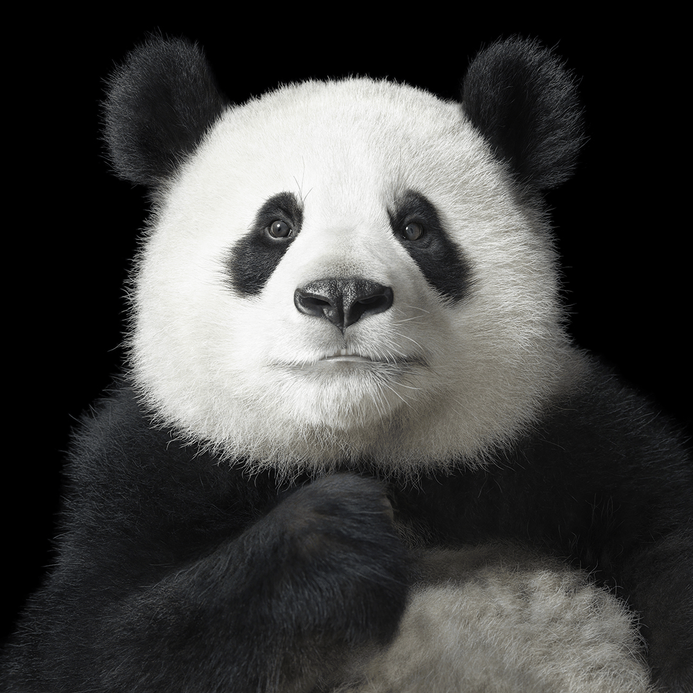
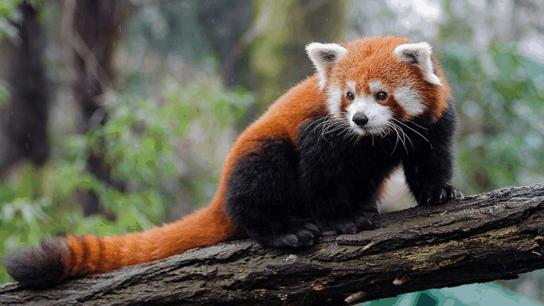

# Examen Final – Computación Visual

Esta carpeta tiene el desarrollo de: **“Examen Final – Computación Visual”**, organizado en dos puntos principales:

- **Punto 1 – Python:** procesamiento de imágenes con filtros, canales de color y operaciones morfológicas, además de una animación en formato GIF.
- **Punto 2 – Three.js:** creación de una escena 3D con formas geométricas básicas, texturas, animaciones, dos cámaras de perspectiva y controles de cámara (OrbitControls).

---

## Estructura del proyecto

```text
.
├── examen_final/
│   ├── python/
│   │   ├── examen_final_python.ipynb
│   │   ├── data/
│       │   ├── animal.jpg
│   │   │   └── animal-2.jpg
│   │   └── gifs/
│   │       ├── procesamiento_animal.gif
│   │       └── procesamiento_animal-2.gif
│   └── threejs/
│       ├── index.html
│       ├── src/
│       │   └── main.js
│       ├── textures/
│       │   ├── floor.jpg
│       │   └── box.jpg
│       └── gifs/
│           └── threejs.gif
└── README.md
```

---

## Punto 1 – Python

En este punto se trabajó con una imagen RGB de un animal en vía de extinción, cargada desde la carpeta `examen_final/python/data/`. Primero se visualiza la imagen original y luego se aplican filtros básicos: un **suavizado gaussiano** para reducir ruido y textura fina, y un **filtro Laplaciano** sobre la versión en escala de grises para resaltar los bordes y contornos más importantes del animal y del fondo.

Posteriormente, se separa la imagen en sus tres canales de color (**R, G y B**) y se visualizan en escala de grises para analizar qué estructuras se ven más claras u oscuras según la cantidad de cada componente de color. Después, se genera una versión **binarizada** de la imagen (usando el **umbral de Otsu**) y sobre ella se aplican operaciones morfológicas de **apertura** y **cierre**: la apertura ayuda a eliminar ruido blanco pequeño y el cierre rellena huecos negros dentro de las regiones principales, dejando los objetos más limpios y compactos.

Finalmente, se crea al menos un **GIF** que muestra de forma secuencial la imagen original, el resultado del suavizado, el realce de bordes, la imagen binarizada y las imágenes después de la apertura y del cierre. Estos GIFs resumen visualmente todo el flujo de procesamiento realizado en el notebook `examen_final/python/examen_final_python.ipynb`.




---

## Punto 2 – Three.js

En este punto se construyó una **escena 3D** usando Three.js, cumpliendo los requisitos del taller: formas geométricas básicas, animaciones, texturas, iluminación, cambio de perspectiva y controles de cámara.

La escena se implementa en `examen_final/threejs/` con el archivo principal `index.html` y el script `src/main.js`. Se utiliza un **import map** para cargar Three.js y OrbitControls directamente desde un CDN, por lo que no es necesario un bundler ni instalación de paquetes vía npm para ejecutar el proyecto de forma básica.

### Descripción de la escena

- Se crea una escena (`THREE.Scene`) con un fondo azul cielo (`0x87ceeb`) y un **piso texturizado** usando `floor.jpg`, repetido varias veces para simular césped o terreno.
- Sobre el piso se ubican cuatro **formas geométricas básicas**, distribuidas en el espacio para formar una pequeña composición 3D:
  - Un **cubo** con textura (`box.jpg`) ubicado a un lado.
  - Una **esfera** de color azul.
  - Un **cilindro** de color naranja.
  - Un **cono** de color amarillo.
- La iluminación está dada por:
  - Una **luz ambiental** (`AmbientLight`) con intensidad alta para iluminar globalmente la escena.
  - Una **luz direccional** (`DirectionalLight`) ubicada en posición elevada, que genera sombras y volumen.

### Cambio de perspectiva (cámaras)

Se definen dos cámaras de perspectiva (`PerspectiveCamera`):

- **Cámara 1 (`camera1`)**: vista diagonal de la escena desde `(10, 10, 10)`.
- **Cámara 2 (`camera2`)**: vista más cenital/vertical desde `(0, 15, 0)`.

La cámara activa se guarda en `activeCamera`, y mediante el botón **“Cambiar cámara”** definido en `index.html` se alterna entre `camera1` y `camera2`. Cada vez que se cambia de cámara, se actualiza también el objeto de OrbitControls (`controls.object = activeCamera`).

### Animación de las formas

En la función `animate()` (bucle de render con `requestAnimationFrame`) se aplican animaciones simples pero continuas:

- El **cubo** rota sobre su eje Y (`rotation.y += 0.02`).
- La **esfera** sube y baja de manera sinusoidal, simulando un movimiento flotante:
  - `sphere.position.y = 1.5 + Math.sin(time * 2) * 0.5`.
- El **cilindro** rota suavemente sobre su eje Y.
- El **cono** rota sobre su eje X.

Estas animaciones se actualizan en cada frame antes de renderizar la escena.

### Texturas e iluminación

- El piso utiliza la textura `floor.jpg`, con repetición (`repeat.set(10, 10)`) para cubrir un área grande (plano de `50 x 50`).
- El cubo utiliza la textura `box.jpg`, aplicada a un `MeshStandardMaterial`.
- Se usan materiales estándar (`MeshStandardMaterial`) que interactúan bien con las luces (`AmbientLight` y `DirectionalLight`) para mostrar sombras y brillos coherentes.

### Controles de cámara (OrbitControls)

Se integra `OrbitControls` importado desde `three/addons/controls/OrbitControls.js`. Esto permite:

- **Rotar** la cámara alrededor del centro de la escena arrastrando con el mouse.
- **Hacer zoom** con la rueda del mouse (acercar/alejar).
- Usar `enableDamping` para que el movimiento sea más suave.

OrbitControls siempre controla la cámara activa (`activeCamera`), de modo que, incluso al cambiar de cámara con el botón, el usuario puede seguir rotando y haciendo zoom sin perder el control de la escena.

### GIFs

En la carpeta `examen_final/threejs/gifs/` se incluye un GIF que muestra:

- La escena desde diferentes perspectivas.
- El cambio de cámara.
- La animación de las formas geométricas.
- El uso de OrbitControls (rotación y zoom).


---

## Instrucciones de ejecución

### 1. Punto 1 – Python (procesamiento de imágenes)

#### Opción A: Ejecutar localmente con Python

1. Clona el repositorio o descarga el proyecto.
2. Entra a la carpeta del taller:
   ```bash
   cd examen_final/python
   ```
3. (Opcional) Crea un entorno virtual e instala dependencias:
   ```bash
   pip install opencv-python matplotlib imageio notebook
   ```
4. Ejecuta Jupyter Notebook:
   ```bash
   jupyter notebook examen_final_python.ipynb
   ```
5. Abre el notebook en el navegador, ejecuta las celdas en orden y se generará el/los GIF(s) en `examen_final/python/gifs/`.

#### Opción B: Ejecutar en Google Colab

1. Sube el archivo `examen_final/python/examen_final_python.ipynb` a Google Colab.
2. Crea una carpeta `data/` en el entorno de Colab y sube la imagen del animal (`animal.jpg`).
3. Ejecuta las celdas del notebook:
   - Se recrearán los filtros, las operaciones morfológicas y el/los GIF(s).
4. Descarga la carpeta `gifs/` generada y colócala en `examen_final/python/` dentro de tu repositorio.

---

### 2. Punto 2 – Three.js (escena 3D)

Este proyecto se ejecuta como una página web estática que carga Three.js y OrbitControls desde un CDN mediante `importmap`, por lo que no requiere compilación ni bundlers.

#### Ejecución con un servidor local simple (Python)

1. Sitúate en la carpeta `threejs`:
   ```bash
   cd examen_final/threejs
   ```
2. Inicia un servidor HTTP sencillo:
   ```bash
   # Python 3
   python -m http.server 8000
   ```
3. Abre tu navegador y entra a:
   ```text
   http://localhost:8000
   ```
4. Deberías ver la escena 3D con:
   - El piso texturizado.
   - Cubo, esfera, cilindro y cono.
   - Animaciones en los objetos.
   - Botón **“Cambiar cámara”** para alternar perspectivas.
   - Posibilidad de rotar y hacer zoom con el mouse (OrbitControls).

#### Ejecución con Live Server (VS Code) – Alternativa

1. Abre la carpeta del proyecto en VS Code:
   - `examen_final/threejs/`
2. Instala la extensión **Live Server** (si no la tienes).
3. Haz clic derecho sobre `index.html` → **“Open with Live Server”**.
4. Se abrirá la escena en tu navegador por defecto y podrás interactuar con ella.

---
